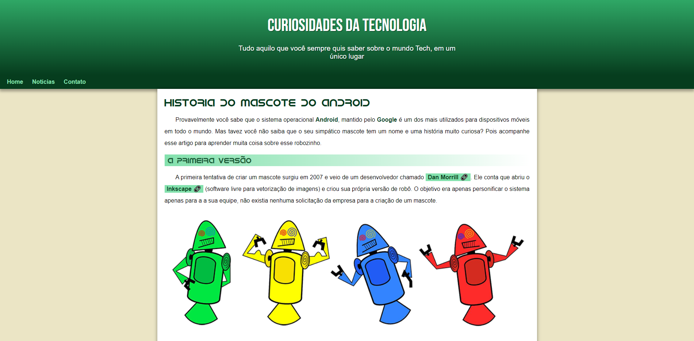

# Projeto Android
> Projeto criado no Capítulo 17 do curso de HTML5 e CSS3: Modulo 2 de 5 do [CursoemVideo](https://www.cursoemvideo.com).
## 🖥️ [Veja o site no ar](https://rfluan.github.io/projeto-android/)

